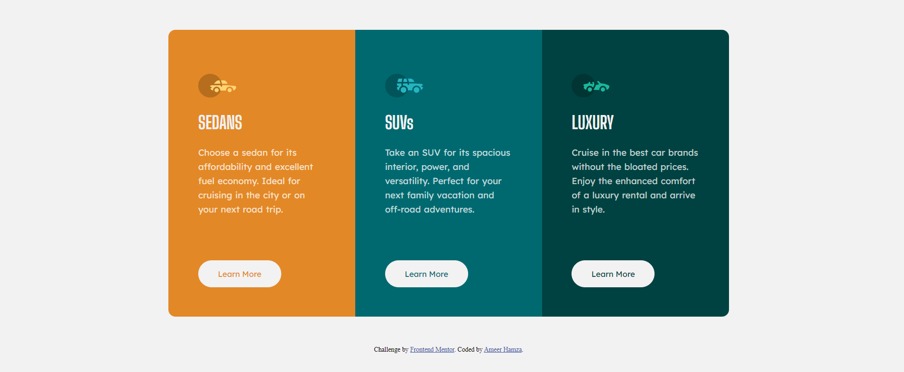

# Frontend Mentor - 3-column preview card component solution

This is a solution to the [3-column preview card component challenge on Frontend Mentor](https://www.frontendmentor.io/challenges/3column-preview-card-component-pH92eAR2-). Frontend Mentor challenges help you improve your coding skills by building realistic projects. 

## Table of contents

- [Overview](#overview)
  - [Screenshot](#screenshot)
  - [Links](#links)
  - [Built with](#built-with)
  - [What I learned](#what-i-learned)
- [Author](#author)

**Note: Delete this note and update the table of contents based on what sections you keep.**

## Overview

  This Project was My Second Project. In This project I was given a 3 column preview card to recreate using HTML and CSS. It was a really nice project I really learned a lot from it. It was really an amazing experience.

### Screenshot

### Links

- Solution URL: [Add solution URL here](https://your-solution-url.com)
- Live Site URL: [Add live site URL here](https://your-live-site-url.com)

### Built with

- Semantic HTML5 markup
- CSS custom properties

### What I learned

  While Writing This project I learn a little bit about (Media Queries) and responsiveness. 

## Author

- Website - [Ameer Hamza](https://www.instagram.com/ameerhamza.6/)
- Frontend Mentor - [@AmeerHamza838](https://www.frontendmentor.io/profile/AmeerHamza838)